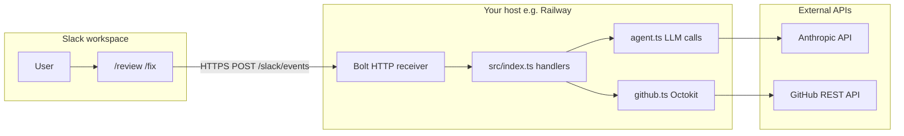

# Mclovin — Slack code-review & fix bot (Beta)

Mclovin is a **trigger-only** Slack bot (no autonomous background jobs). Users invoke it from Slack; the service runs on your infrastructure (e.g. Railway), calls **Anthropic Claude** for reasoning, and uses the **GitHub API** to read diffs and open pull requests.

## What it does today

| Trigger | Behavior |
|--------|----------|
| `/review` + GitHub PR URL | Fetches the PR diff via GitHub, sends it to Claude, posts a review summary to the channel. |
| `/fix owner/repo …` | Plans candidate file paths, loads file contents, asks Claude for full updated files, commits to a new branch `mclovin/fix-<timestamp>`, opens a PR against the default branch. Optional: set `DEFAULT_GITHUB_OWNER` / `DEFAULT_GITHUB_REPO` to omit `owner/repo`. |
| `@Mclovin` (optional) | Short help message (requires Event Subscriptions + `app_mention`). |

The “agent” in this repo is **not** Cursor or a third-party agent product. It is **your Node service** plus the **Anthropic Messages API** (`@anthropic-ai/sdk` in `src/lib/agent.ts`) and **Octokit** (`src/lib/github.ts`).

## Architecture



- **Slack** delivers slash commands and (if enabled) events to a single public URL: `https://<host>/slack/events`. Requests are verified with the **Signing Secret**.
- **Bolt** (`@slack/bolt`) parses payloads and runs handlers registered in `src/index.ts`.
- **LLM** calls are isolated in `src/lib/agent.ts` (prompts, truncation, JSON parsing for the fix flow).
- **GitHub** operations are isolated in `src/lib/github.ts` (PR diff, branches, file content, PR create).

`GET /health` returns `ok` for load balancers and quick checks.

## Tech stack

- **Runtime:** Node 20+ (ESM, TypeScript compiled to `dist/`).
- **Slack:** `@slack/bolt` with `ExpressReceiver` (HTTP, not Socket Mode in this POC).
- **LLM:** Anthropic **Claude** via `@anthropic-ai/sdk`; model via `ANTHROPIC_MODEL` (see below).
- **GitHub:** `@octokit/rest` with a PAT or fine-grained token (`GITHUB_TOKEN`).
- **Deploy:** `Dockerfile` + optional `fly.toml`; production run uses `node dist/index.js`.

### Claude API access

- **Direct Anthropic:** create an API key in the [Anthropic Console](https://console.anthropic.com/) and set `ANTHROPIC_API_KEY`. Your org may provision keys or a shared account—in that case use the model IDs they document.
- **Other channels:** If your company routes Claude through **AWS Bedrock**, **Google Vertex**, etc., this codebase uses the **first-party Anthropic API** only. You would add a small adapter in `agent.ts` (or swap the client) to call that provider’s endpoint while keeping Slack/GitHub unchanged.

Set **`ANTHROPIC_MODEL`** to a model string your key is allowed to use (examples you may see in docs: `claude-3-5-sonnet-20241022`, or newer IDs as Anthropic releases them). The default in code is `claude-3-5-sonnet-20241022`; override if your org standardizes on another snapshot.

## Configuration

See `.env.example` for all variables. Required at minimum:

- `SLACK_BOT_TOKEN` — Bot User OAuth Token (`xoxb-…`) after installing the app to the workspace.
- `SLACK_SIGNING_SECRET` — From the Slack app’s **Basic Information**.
- `GITHUB_TOKEN` — Repo access for contents and pull requests.
- `ANTHROPIC_API_KEY` — For Claude API calls.

Optional:

- `ANTHROPIC_MODEL` — Claude model id (must match your API access).

Operational notes (Slack install, OAuth scopes, Railway/Fly, troubleshooting) are in **`SETUP.txt`**.

## Repository layout

```
src/
  index.ts       # Bolt app, slash commands, app_mention, /health
  config.ts      # Env validation and accessors
  lib/
    agent.ts     # Claude (Anthropic): review, fix path plan, fix file generation
    github.ts    # PR diff, refs, file CRUD, open PR
```

## How to extend behavior

1. **New slash commands**  
   Register with `app.command("/name", handler)` in `src/index.ts`. Register the same command in the Slack app (**Slash Commands**) with Request URL `https://<host>/slack/events`.

2. **Stronger or different “agent” logic**  
   - Adjust prompts and `max_tokens` / temperature in `src/lib/agent.ts`.  
   - Add **tool use** (Anthropic tools) or multi-step loops inside `agent.ts` without changing Slack wiring.  
   - If your org uses Bedrock/Vertex, replace the `Anthropic` client usage with that provider’s SDK while keeping the same handler signatures.

3. **More GitHub actions**  
   Add helpers in `src/lib/github.ts` (labels, reviewers, checks) and call them from handlers after the LLM or user confirms.

4. **Richer Slack UX**  
   Use Block Kit (`blocks` in `chat.postMessage`), **buttons** (`app.action`), **modals** (`app.view`), or **shortcuts** so users confirm before opening a PR or pasting a PR URL.

5. **Thread context for `/fix`**  
   The POC passes an empty `threadContext`; you can pass `command` payload fields or use a message shortcut to include parent thread text.

6. **Safety and governance**  
   Allowlists (channel IDs, user IDs), max diff size (already partially truncated in `agent.ts`), required PR approval in GitHub, or a “dry run” mode that only posts the proposed diff to Slack.

7. **Observability**  
   Structured logging around each handler, optional correlation IDs from Slack `response_url` / `trigger_id`, and metrics on your host.

---

**Disclaimer:** Beta POC — review LLM output and PRs before merging; tune tokens and repository permissions for your org.
